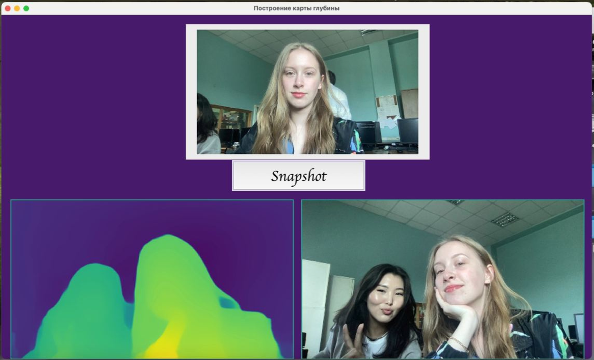

## Creating a depth map using the MiDaS model.    
## Создание карты глубины с использованием модели MiDaS. 🗺

     

Проект представляет собой систему для вычисления карты глубины из монохромных изображений с помощью модели MiDaS (Monocular Depth Estimation). Используя веб-камеру, приложение захватывает изображение, передает его в модель для предсказания глубины, а затем отображает результат в графическом интерфейсе.

### 🖥 Основные области интерфейса:
* Верхняя центральная часть (label1) — Видео с камеры: Показывает потоковое видео с веб-камеры в реальном времени.
* Левая часть (label2) — Карта глубины: Отображает вычисленную карту глубины для захваченного изображения.
* Правая часть (label3) — Исходное изображение: Показывает исходное изображение, захваченное с камеры.
* Кнопка Snapshot: Позволяет сделать снимок с камеры, сохранить его и создать карту глубины для этого снимка.

### 🚀 Как запустить:   
1. Установите необходимые зависимости: _pip install torch opencv-python matplotlib pillow_
2. Запустите _main.py_ для старта интерфейса.
3. Нажмите кнопку "Snapshot" для создания карты глубины.

### ❕ Примечание: 
Модель MiDaS работает только с одним изображением и генерирует предсказанную карту глубины, которая является результатом оценки, а не фактической глубиной сцены. 

